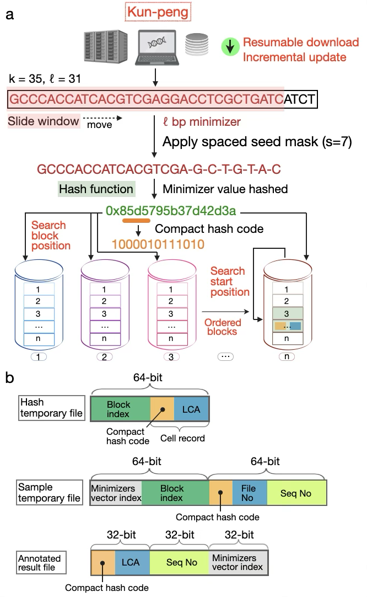

# Kun-peng 

[]() [](https://github.com/eric9n/Kun-peng/releases)

We developed Kun-peng, an accurate and highly scalable low-memory tool for classifying metagenomic sequences.

Inspired by Kraken2's k-mer-based approach, Kun-peng incorporates an advanced sliding window algorithm during sample classification and, crucially, employs an ordered chunks method when building the reference database. This approach allows the database to be constructed in the format of sub-databases of any desired chunk size, significantly reducing running memory usage by orders of magnitude. These improvements enable running Kun-peng on personal computers and HPC platforms alike. In practice, for any larger indices, the Kun-peng would allow the taxonomic classification task to be executable on essentially all computing platforms without the need for the traditionally expensive and rare high-memory node.

Importantly, the flexible structure of the reference index also allows the construction and utilization of supermassive indices that were previously infeasible due to computational restraints. Supermassive indices, incorporating the growing genomic data from prokaryotes and eukaryotes, as well as metagenomic assemblies, are crucial in investigating the more diverse and complex environmental metagenomes, such as the exposome research.

The name "Kun-peng" is a massive mythical creature capable of transforming from a giant fish in the water (Kun) to a giant bird in the sky (Peng) from Chinese mythology, reflecting the flexible nature and capacity of the software to efficiently navigate the vast and complex landscapes of metagenomic data.



## Get Started

Follow these steps to install Kun-peng and run the examples.

### Method 1: Download Pre-built Binaries (Recommended)

If you prefer not to build from source, you can download the pre-built binaries for your platform from the GitHub [releases page](https://github.com/eric9n/Kun-peng/releases).

``` bash
mkdir kun_peng_v0.6.10
tar -xvf Kun-peng-v0.6.10-centos7.tar.gz -C kun_peng_v0.6.10
# Add environment variable
echo 'export PATH=$PATH:~/biosoft/kun_peng_v0.6.10' >> ~/.bashrc
source ~/.bashrc
```

#### Run the `kun_peng` example

We will use a very small virus database on the GitHub homepage as an example:

1.  download database

``` sh
git clone https://github.com/eric9n/Kun-peng.git
cd kun_peng
```

2.  build database

``` sh
kun_peng build --download-dir data/ --db test_database
```

```
merge fna start...
merge fna took: 29.998258ms
estimate start...
estimate count: 14080, required capacity: 31818.0, Estimated hash table requirement: 124.29KB
convert fna file "test_database/library.fna"
process chunk file 1/1: duration: 29.326627ms
build k2 db took: 30.847894ms
```

3.  classify

``` sh
# temp_chunk is used to store intermediate files
mkdir temp_chunk
# test_out is used to store output files
mkdir test_out
kun_peng classify --db test_database --chunk-dir temp_chunk --output-dir test_out data/COVID_19.fa
```

```
hash_config HashConfig { value_mask: 31, value_bits: 5, capacity: 31818, size: 13051, hash_capacity: 1073741824 }
splitr start...
splitr took: 18.212452ms
annotate start...
chunk_file "temp_chunk/sample_1.k2"
load table took: 548.911µs
annotate took: 12.006329ms
resolve start...
resolve took: 39.571515ms
Classify took: 92.519365ms
```

### Method 2: Clone the Repository and Build the project

#### Prerequisites

1.  **Rust**: This project requires the Rust programming environment if you plan to build from source.

#### Build the Projects

First, clone this repository to your local machine:

``` sh
git clone https://github.com/eric9n/Kun-peng.git
cd kun_peng
```

Ensure that both projects are built. You can do this by running the following command from the root of the workspace:

``` sh
cargo build --release
```

This will build the kr2r and ncbi project in release mode.

#### Run the `kun_peng` example

Next, run the example script that demonstrates how to use the `kun_peng` binary. Execute the following command from the root of the workspace:

``` sh
cargo run --release --example build_and_classify --package kr2r
```

This will run the build_and_classify.rs example located in the kr2r project's examples directory.

Example Output You should see output similar to the following:

``` txt
Executing command: /path/to/workspace/target/release/kun_peng build --download-dir data/ --db test_database
kun_peng build output: [build output here]
kun_peng build error: [any build errors here]

Executing command: /path/to/workspace/target/release/kun_peng direct --db test_database data/COVID_19.fa
kun_peng direct output: [direct output here]
kun_peng direct error: [any direct errors here]
```

This output confirms that the `kun_peng` commands were executed successfully and the files were processed as expected.

## [ncbi](./ncbi/README.md)

## [kun_peng](./kr2r/README.md)
